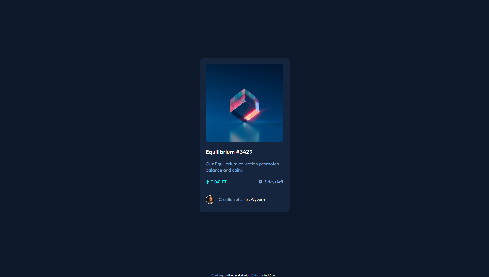
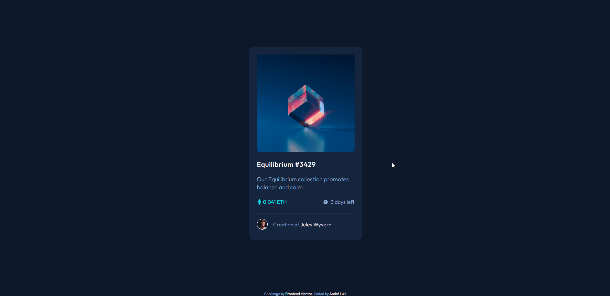

# Frontend Mentor - NFT preview card component solution

Essa é a solução do desafio [NFT preview card component](https://www.frontendmentor.io/challenges/nft-preview-card-component-SbdUL_w0U) do Frontend Mentor. 

## Índice

- [Overview](#overview)
  - [O desafio](#o-desafio)
  - [Screenshots](#screenshots)
  - [Links](#links)
- [Meu processo](#meu-processo)
  - [Feito com](#feito-com)
  - [O que eu aprendi](#o-que-eu-aprendi)
  - [Continuação do meu desenvolvimento](#continuação-do-meu-desenvolvimento)
- [Autor](#autor)

## Overview

### O Desafio

Os usuários poderão:

- Ver o layout ideal dependendo do tamanho da tela do dispositivo;
- Interagir com o elementos;

### Screenshots





### Links

- Repositório: [GitHub - NFT preview card](https://github.com/andre-pixioline/nft-preview-card-component)
- Live Site URL: [GitHub Pages](https://andre-pixioline.github.io/nft-preview-card-component/)

## Meu processo

### Feito com

- HTML5
- CSS 
- Flexbox
- Variáveis de root

### O que eu aprendi

Com esse desafio aprendi melhor a usar ícones em conjunto com os elementos do site, o alinhamento com o flex-box, e principalmente os active-states da imagem usando o before e o after.

Alguns códigos que usei:

```css
.card .img-link:hover::before {
    opacity: 0.3;
    transition: 0.4 ease-in-out; 
}

.card .img-link:hover::after {
    opacity: 1;
    transition: 0.4s ease-in-out;
}

 .card .img-link::before {
    content: '';
    background-color: cyan;
    width: 100%;
    height: 100%;
    border-radius: 8px;
    position: absolute;
    opacity: 0;
}
```
### Continuação do meu desenvolvimento

Vou praticar mais a centralização, alinhamento de elementos, dominar mais o HTML e CSS, e posteriormente JS, para poder fazer projetos cada vez melhores e estudando para aprender a melhorar meu código e meus projetos.

## Autor

- Frontend Mentor - [andre-pixioline](https://www.frontendmentor.io/profile/andre-pixioline)
- Instagram - [@andrepixioline](https://www.instagram.com/andrepixioline/)
- Linkedin - [André Luiz Pixioline](https://www.linkedin.com/in/andre-pixioline/)

